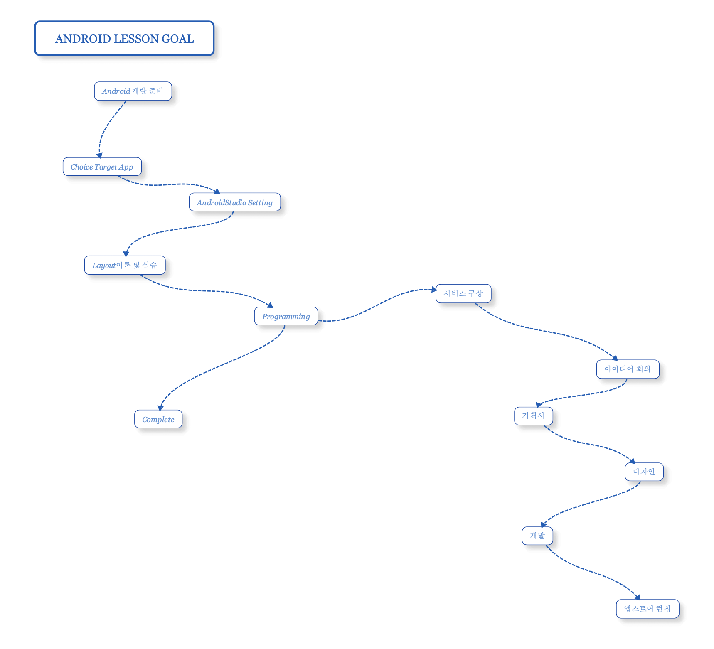
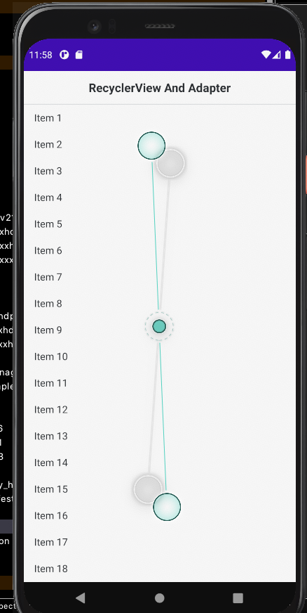

# Android입문자를 위한 프로그래밍 레슨 

## 레슨 목표
- 화면을 구성하기 위한 Layout에 대한 이해 및 실습
- 기존에 작업한 Layout을 이용해서 메인페이지 완성
- Class 기초 
- 컴포넌트 (View) 기초
- Kotlin Extension을 이용한 컴포넌트 연결 및 사용
- 반복되는 디자인을 제어하고 데이터를 연결하는 방법 (GridView)
- 리스트를 구성하기 위한 Adapter
- 페이징 처리를 위한 ViewPager2와 Fragment

## 기본 셋팅
- Kotlin-Extensions   
  https://developer.android.com/kotlin/ktx?hl=ko
  
## 레슨 0
- Android Layout의 이론과 실습
- 소요 : 10 class 

## 레슨 1 ( Kotlin Extension, findViewById, ConstraintLayout, Button, TextView, EditText, Event, Toast )
- Kotlin Extension을 이용한 layout의 컴포넌트(View) 접근
- findViewById를 이용한 layout의 컴포넌트 접근
- ConstraintLayout 기본
- Button의 Click Event 연결
- 컴포넌트값 변경하기
- EditText 사용방법
- Toast 사용방법
- 객체와 파라머터에 대한 가벼운 이야기 (Toast)

## 레슨 2 ( RecyclerView, Adapter, ViewHolder )
- 리스트를 구성하는 가장 쉬운 방법 RecyclerView
- Adapter란?
- ViewHolder란?

## 레슨 내용
- drawable (xxxhdpi, xxhdpi, xhdpi, shape)   
  https://developer.android.com/guide/topics/resources/drawable-resource?hl=ko
  
- layout (f_xxxxx, l_xxxxx, i_xxxxx)   
  https://developer.android.com/guide/topics/resources/layout-resource?hl=ko

- ConstraintLayout ( 기본 )  
  https://developer.android.com/training/constraint-layout?hl=ko

- EditText ( text input and event) & Focus Trick   
  https://developer.android.com/reference/android/widget/EditText
  
- SoftKeyboard

- Event

- Kotlin ( 기본 개념 )   
  https://developer.android.com/kotlin/learn?hl=ko   
  https://kotlinlang.org/docs/tutorials/getting-started.html
  
- Class (기본)   
  https://kotlinlang.org/docs/reference/classes.html   
  https://kotlinlang.org/docs/tutorials/kotlin-for-py/classes.html

- RecyclerView   
  https://developer.android.com/guide/topics/ui/layout/recyclerview?hl=ko
  
- GridView   
  https://developer.android.com/reference/android/widget/GridView
  
- Adapter   
  https://developer.android.com/reference/android/widget/Adapter
  
- ViewPager2   
  https://developer.android.com/training/animation/vp2-migration?hl=ko   
  https://developer.android.com/jetpack/androidx/releases/viewpager2#version_110_2

- Fragment   
  https://developer.android.com/guide/components/fragments
  
     
        
  ## ScreenShot
  
